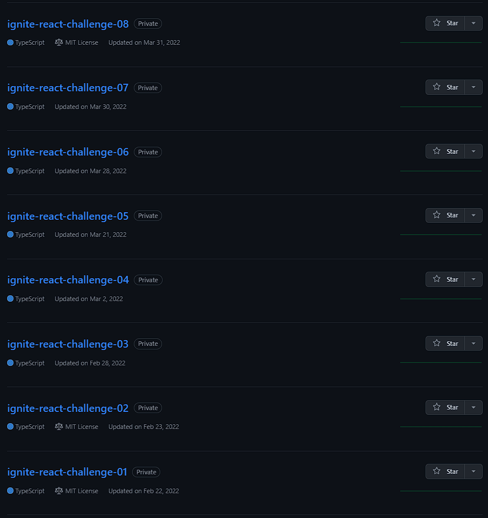

# ignite-react

Projects developed in Rocketseat's Ignite - React module. Started in 2022, from February 22nd to March 31st.

## Certificate

Here is the course certificate:
[Certificate](ignite-react-certificate.pdf)

You can validate it in Rocketseat's website:
[Certificate Validation](https://app.rocketseat.com.br/certificates/d1a6b51d-091d-42e0-bf9c-4cd80407cb77)

## All Challenges in one place

Instead of display each repository in my profile, i created that repo with all content in one place. With that, i lost the commits history, but i think it's better this way.

Here is a print with the private repositories and their last updated date:
